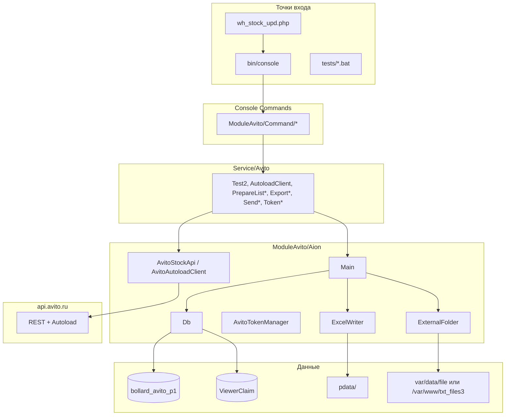
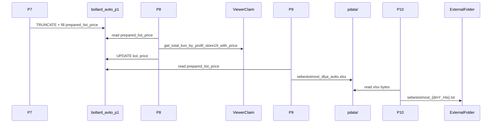

# Анализ проекта cursSF64avitoP2 / sf64avitoP2

Документ собран по результатам полного разбора кодовой базы и доработок в рамках **taskp5362** (себестоимость для Avito).  
Дата актуализации: 2026-10-07.

---

## 1. Назначение проекта

**Symfony 6.4 CLI-приложение** (PHP ≥ 8.1) для синхронизации данных с **Avito**:

- загрузка списка объявлений и остатков с API Avito;
- маппинг `avito_id ↔ ad_id` (Autoload API);
- подготовка staging-таблиц в PostgreSQL;
- получение количества и **MinPrice** со склада 19 (БД **ViewerClaim** / «Маяк»);
- обновление остатков на Avito (шаги P4–P6, сейчас отключены в cron);
- **taskp5362:** цепочка P7–P10 — `prepared_list_price`, Excel себестоимости, выгрузка во внешнюю папку.

Приложение **не является веб-API**: HTTP-контроллеров нет, основной режим — **cron + Symfony Console**.

> **Репозиторий:** в git отслеживаются в основном `sql/`, `.gitignore`, `docs/`. Код приложения лежит в `sf64avitoP2/` (в `.gitignore` указано `/Sf64avitoP2/` — проверить регистр пути на машине разработчика).

---

## 2. Структура каталогов

```
cursSF64avitoP2/
├── docs/
│   └── PROJECT_ANALYSIS.md          # этот файл
├── sql/
│   ├── bollard_avito_p2.sql         # DDL staging-БД Avito
│   └── Part_ofViewerClime.sql       # ViewerClaim: mBest4, функции KVO
└── sf64avitoP2/                     # Symfony-приложение
    ├── bin/console
    ├── public/index.php             # HTTP front (без маршрутов приложения)
    ├── config/
    ├── crone/Procedures/
    │   ├── wh_stock_upd.php         # оркестратор P1–P10
    │   └── shedule.txt
    ├── src/
    │   ├── Kernel.php
    │   ├── ModuleAvito/
    │   │   ├── Aion/                # ядро: Db, Main, API, Excel, ExternalFolder
    │   │   └── Command/             # Symfony-команды
    │   └── Service/Avito/           # сервисный слой
    ├── swagger/                     # OpenAPI Avito (справочно)
    └── tests/*.bat                  # ручной запуск команд (Windows)
```

### Стек

| Слой | Технология |
|------|------------|
| Framework | Symfony 6.4 (Console, FrameworkBundle) |
| БД | PostgreSQL 11, **PDO**, без ORM |
| HTTP к Avito | cURL |
| Excel | PhpOffice/PhpSpreadsheet |
| Frontend | отсутствует |

---

## 3. Архитектура (слои)



**Паттерн:** Cron → `exec(php bin/console …)` → Command → Service → `Main` → `Db` / API / файлы.

Symfony DI используется **частично**; многие команды создают сервисы через `new`.

---

## 4. Точки входа

| # | Файл | Роль |
|---|------|------|
| 1 | `sf64avitoP2/crone/Procedures/wh_stock_upd.php` | **Основной cron** — P1–P10 |
| 2 | `sf64avitoP2/bin/console` | Symfony CLI |
| 3 | `sf64avitoP2/public/index.php` | HTTP Kernel (без app-контроллеров) |
| 4 | `sf64avitoP2/tests/*.bat` | Ручной запуск на Windows |

> Файл `wh_stock_opd.php` **не существует**; актуальный скрипт — **`wh_stock_upd.php`**.

---

## 5. HTTP-маршруты и Console-команды

### HTTP

**Нет** пользовательских маршрутов. `config/routes.yaml` указывает на `src/Controller/`, каталог отсутствует.

### Symfony Console (полный список по состоянию проекта)

| Команда | Назначение | Cron |
|---------|------------|------|
| `app:get-all-products-command` | P1 — объявления → `avito_product_list` | P1 |
| `app:get_adids-by-avitoids-command` | P2 — `avito_id → ad_id` | P2 |
| `app:get-all-stocks-command` | P3 — остатки → `inventory_avito` | P3 |
| `app:step-prepare-list-command` | P4 — `prepared_list` | P4 (active=0) |
| `app:step-prepare-list-set-kol-command` | P5 — kol из ViewerClaim | P5 (active=0) |
| `app:step_update_stocks-command` | P6 — push остатков на Avito | P6 (active=0) |
| `app:step-prepare-list-price-command` | P7 — `prepared_list_price` | P7 |
| `app:step-prepare-list-set-kol-with-price-command` | P8 — kol + MinPrice | P8 |
| `app:step-export-avito-cost-price-excel-command` | P9 — Excel в pdata | P9 |
| `app:step-send-avito-cost-price-file-command` | P10 — pdata → внешняя папка | P10 |
| `app:avito:token:init` | OAuth init (avz_api) | — |
| `app:avito:token:status` | статус токена | — |
| `app:avito:token:refresh` | refresh токена | — |

---

## 6. Основные модули

### 6.1 `ModuleAvito/Aion` — ядро

| Класс | Назначение |
|-------|------------|
| `Db.php` | Все SQL-запросы (2 PDO-соединения) |
| `Main.php` | Оркестрация бизнес-шагов |
| `AvitoStockApi.php` | Items, stocks, OAuth client_credentials |
| `AvitoAutoloadClient.php` | `GET /autoload/v2/items/ad_ids` |
| `AvitoTokenManager.php` | refresh_token, файл `pdata/avito_token.json` |
| `Config.php` | `config/config.json` |
| `Excel/Writer/ExcelWriter.php` | экспорт себестоимости в xlsx |
| `ExternalFolder.php` | копия файла во внешний каталог (P10) |
| `Steps.php` | импорт `avito.xlsx` → `avz_products` |

### 6.2 `Service/Avito`

| Сервис | Шаг |
|--------|-----|
| `Test2` | P1 |
| `AutoloadClient` | P2 |
| `Test3` | P3 |
| `PrepareList` | P4 |
| `PrepareListKol` | P5 |
| `UpdateStocks` | P6 |
| `PrepareListPrice` | P7 |
| `PrepareListSetKolWithPrice` | P8 |
| `ExportAvitoCostPriceExcel` | P9 |
| `SendAvitoCostPriceFile` | P10 |
| `AvitoTokenInit` | OAuth init |
| `Step1` | импорт `avito.xlsx` (отдельный поток) |

### 6.3 Контроллеры и модели

- **Controllers:** нет  
- **Doctrine / Entity:** нет  
- **Модели:** роль выполняют `Db` + массивы строк PDO

---

## 7. PostgreSQL

### Подключения (`Db.php`, захардкожено)

| PDO | Host | БД | Назначение |
|-----|------|-----|------------|
| `$conn` | 192.168.9.196:5432 | `bollard_avito_p1` | Staging Avito |
| `$conn2` | 192.168.9.196:5432 | `ViewerClaim` | Склад «Маяк» |

> DDL-дамп: `bollard_avito_p2.sql`; runtime — **`bollard_avito_p1`**.  
> Переменные `DB_HOST*` из `.env` в `Db.php` **не используются**.

### Таблицы `bollard_avito_p1` (основные)

| Таблица | Назначение |
|---------|------------|
| `avito_product_list` | объявления с Avito |
| `products_map` | `avito_id ↔ ad_id` |
| `inventory_avito` | остатки с Avito |
| `prepared_list` | staging для P4–P6 |
| `prepared_list_price` | staging для P7–P10 (taskp5362) |
| `avz_products` | импорт из `avito.xlsx` |

### ViewerClaim

| Объект | Назначение |
|--------|------------|
| `mBest4`, `TovarPart`, `PodrMesto` | каталог и остатки |
| `get_total_kvo_by_profil_store19()` | SUM(KVO) по профилям, склад 19 |
| `get_total_kvo_by_profil_store19_with_price()` | + **MinPrice** (taskp5362) |

---

## 8. SQL в коде (`Db.php`)

### `prepared_list` (P4–P6)

- `insert_prepared_list`, `get_prepared_list`, `delete_prepared_list`, `update_prepared_list`

### `prepared_list_price` (P7–P10)

- `insert_prepared_list_price`, `get_prepared_list_price`, `delete_prepared_list_price`, `update_prepared_list_price` (+ опциональное поле `price` при UPDATE)

### Прочее

- CRUD для `avito_product_list`, `products_map`, `inventory_avito`, `avz_products`
- `getStock()` / `getStockWithPrice()` — вызов функций на `conn2`
- `update_avito_product_list_price_by_ad_id()` — есть в коде; использование зависит от версии `Main`

DDL для `prepared_list_price` может потребоваться отдельно в БД, если таблица ещё не создана на сервере.

---

## 9. API Avito

### Два OAuth-приложения (`config/config.json`)

| Ключ | Grant | Использование |
|------|-------|----------------|
| `auth.personal` | `client_credentials` | P1, P3, P6 — `AvitoStockApi` |
| `auth.avz_api` | `authorization_code` + `refresh_token` | P2 — Autoload, `AvitoTokenManager` |

### Эндпоинты (используемые в коде)

| Метод | Endpoint |
|-------|----------|
| POST | `/token` |
| GET | `/core/v1/items` |
| POST | `/stock-management/1/info` |
| PUT | `/stock-management/1/stocks` |
| GET | `/autoload/v2/items/ad_ids` |

### Инициализация токена (реализовано)

```bash
php bin/console app:avito:token:init --show-url
php bin/console app:avito:token:init --code=...
php bin/console app:avito:token:status
php bin/console app:avito:token:refresh
```

Scopes (ручной OAuth): `items:info,user:read,autoload:reports,stats:read`  
Redirect URI: `https://www.avz.ru/avito_collback.php`

---

## 10. Yandex Disk / Direct

| Тема | Статус |
|------|--------|
| **Yandex Disk API** | **нет** в коде |
| `avito.xlsx` | комментарий: файл попадает на Disk **внешним** процессом; приложение читает локальный `pdata/avito.xlsx` |
| `YANDEX_DIRECT_TOKEN` в `.env` | инжект в Test2/Test3, **в коде не используется** |

---

## 11. Cron: `wh_stock_upd.php`

- Аргумент: `php wh_stock_upd.php 1`
- Лог: `var/logs/crone/{type}.log`
- Флаг `$test = true` подставляет argv для локального запуска
- Выполняет **P1–P10** (неактивные шаги только логируют «not active»)

### Актуальная конфигурация шагов

| Шаг | active | Команда |
|-----|--------|---------|
| P1 | 1 | get-all-products |
| P2 | 1 | get_adids-by-avitoids |
| P3 | 1 | get-all-stocks |
| P4 | 0 | step-prepare-list |
| P5 | 0 | step-prepare-list-set-kol |
| P6 | 0 | step_update_stocks |
| P7 | 1 | step-prepare-list-price |
| P8 | 1 | step-prepare-list-set-kol-with-price |
| P9 | 1 | step-export-avito-cost-price-excel |
| P10 | 1 | step-send-avito-cost-price-file |

### Поток taskp5362 (активная ветка)



---

## 12. Excel себестоимости (P9)

**Класс:** `App\ModuleAvito\Aion\Excel\Writer\ExcelWriter`  
**Файл:** `src/ModuleAvito/Aion/pdata/sebestoimost_dlya_avito.xlsx`  
(ранее в обсуждении фигурировало имя «Себестоимость для Авито.xlsx» — в коде константа `FILENAME = sebestoimost_dlya_avito.xlsx`.)

| Колонка Excel | Поле БД |
|---------------|---------|
| Номер объявления | `prepared_list_price.product_id` |
| ID объявления | `prepared_list_price.offer_id` |
| Себестоимость | `prepared_list_price.price` |

---

## 13. P10 — внешняя выгрузка

**Класс:** `ExternalFolder`  
**Логика:** `Main::SendAvitoCostPriceFile()` — читает xlsx из pdata, имя `sebestoimost_{Europe/Moscow dmY_His}.txt`, `file_put_contents`.

| ОС | Каталог назначения |
|----|-------------------|
| Windows | `{project}/var/data/file/` |
| Linux | `/var/www/txt_files3/` |

> Ранее использовался `ModuleOzon\Aion\IonFile` — **удалён**, сохранение стандартное через `file_put_contents`.

---

## 14. Карта зависимостей (кратко)

```
Cron → Commands → Services → Main → Db / AvitoStockApi / ExcelWriter / ExternalFolder
AutoloadClient → AvitoAutoloadClient → AvitoTokenManager → avito_token.json
P8 → Db.getStockWithPrice → ViewerClaim function
```

---

## 15. Поток данных (остатки, legacy P4–P6)

```
Avito API → avito_product_list → prepared_list → ViewerClaim (kol) → prepared_list → Avito stocks API
```

Сейчас в cron **отключён** (P4–P6 `active=0`).

---

## 16. Изменения, выполненные в ходе работы (хронология)

1. **Архитектурный отчёт** — первичный обзор (CLI, dual DB, Avito API).
2. **tests/*.bat** — путь заменён на `D:\site_next_next\cursSF64avitoP2\sf64avitoP2`.
3. **OAuth Avito** — команды `app:avito:token:init|status|refresh`, доработка `AvitoTokenManager`.
4. **P7** — `PrepareListPrice`, `prepared_list_price`, команда `step-prepare-list-price`.
5. **P8** — `PrepareListSetKolWithPrice` (сервис как `PrepareListKol`; в `Main` — `getStockWithPrice`, update `prepared_list_price`).
6. **Db.php** — методы `*_prepared_list_price`.
7. **P9** — `ExcelWriter`, экспорт xlsx.
8. **P10** — `SendAvitoCostPriceFile`, `ExternalFolder` без IonFile/ModuleOzon.
9. **Cron** — P7–P10, P4–P6 выключены.

---

## 17. Commits и метки

| Версия / commit (со слов пользователя) | Метка |
|----------------------------------------|-------|
| `v.0.11 taskp5362: prepared_list_price, Excel export P9 and cost price pipeline` | **KJvJVv5708ufkfkgk002** |
| P10 + ExternalFolder (предлагалось) | **KJvJVv5708ufkfkgk003** |
| Ранее в сессии | **KJvJVv5708ufkfkgk001** |

---

## 18. AccessorySubType (Avito)

**В коде проекта не найден.**

| Контекст | Значение |
|----------|----------|
| Autoload Excel/XML | Параметр категории (подтип аксессуара/запчасти) из справочника Avito |
| REST API остатков/объявлений | **не используется** |
| P7–P10 / sebestoimost | **не относится** |
| `avito.xlsx` (Step1) | может быть колонкой шаблона автозагрузки; в `Steps.php` читаются только **A, AI, AM** |

---

## 19. Риски и замечания

| # | Тема |
|---|------|
| 1 | Credentials в `Db.php`, `config.json`, `.env` |
| 2 | SQL через `sprintf` — риск injection |
| 3 | `UpdateStocks` — возможный debug-лимит `$k < 1` (проверить перед prod) |
| 4 | Таблица `prepared_list_price` — убедиться, что создана в БД |
| 5 | P10 сохраняет **содержимое xlsx** в файл `.txt` (бинарная копия) — осознанное поведение |
| 6 | `wh_stock_upd.php`: `$test = true` — на prod должно быть `false` |
| 7 | Symfony DI частично обходится (`new` в commands) |

---

## 20. Справочные пути

| Ресурс | Путь |
|--------|------|
| Конфиг Avito | `sf64avitoP2/src/ModuleAvito/Aion/config/config.json` |
| OAuth tokens | `sf64avitoP2/src/ModuleAvito/Aion/pdata/avito_token.json` |
| Excel autoload (вход) | `sf64avitoP2/src/ModuleAvito/Aion/pdata/avito.xlsx` |
| Excel себестоимости (выход P9) | `sf64avitoP2/src/ModuleAvito/Aion/pdata/sebestoimost_dlya_avito.xlsx` |
| Cron | `sf64avitoP2/crone/Procedures/wh_stock_upd.php` |
| SQL schemas | `sql/bollard_avito_p2.sql`, `sql/Part_ofViewerClime.sql` |

---

## 21. Тестовые bat (Windows)

Примеры:

- `run_get-all-products.bat`
- `run_step_prepare_list_price.bat`
- `run_step_prepare_list_set_kol_with_price.bat`
- `run_step_export_avito_cost_price_excel.bat`
- `run_step_send_avito_cost_price_file.bat`
- `run_avito_token_init_show_url.bat`, `run_avito_token_status.bat`, `run_avito_token_refresh.bat`

Базовый путь в bat: `D:\site_next_next\cursSF64avitoP2\sf64avitoP2\bin\console`.

---

*Конец документа. При изменении cron, имён файлов или схемы БД — обновлять разделы 11, 12, 13 и 16.*
